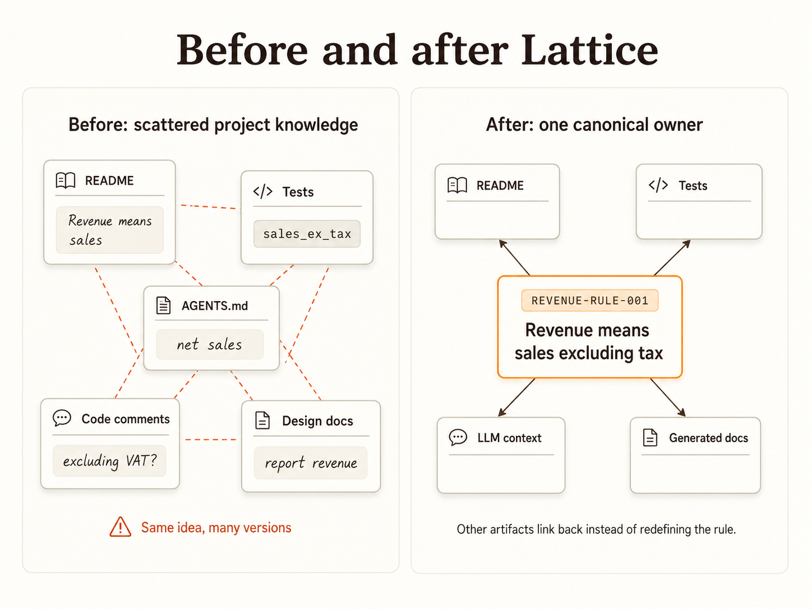
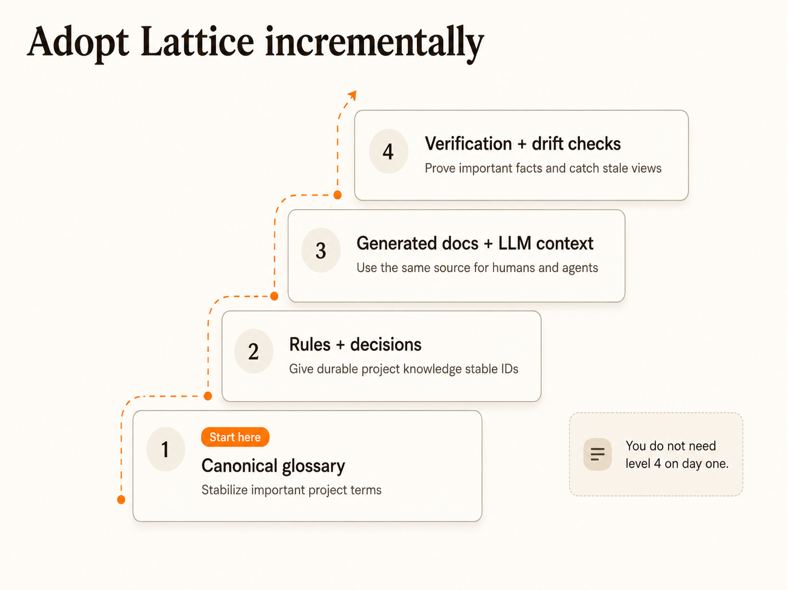

# Lattice

<!-- This document is generated by Lattice. Edit the source specs, not this prose. -->
<!-- owner: LATTICE-DOC-001 -->

Lattice helps teams keep project knowledge from drifting by giving durable facts one source of truth and generating documentation, LLM context, validation, verification checks, and drift reports from that registry.

## The problem

Most projects repeat the same important idea in many places: design docs, README files, tests, prompts, comments, and source code. At first this is fine. Later, one copy changes and the others do not. Lattice treats that as drift.



## Inspect the graph

- `LATTICE-DECISION-058` (decision): List registry types and specs from the CLI - Documents the registry inspection CLI command so maintainers and agents can see both registry types and authored specs from one entry point.

## What Lattice gives you

These source specs describe the current Lattice value proposition without making README.md the durable owner of those claims.

- One canonical owner for each durable project fact.
- Stable IDs that docs, tests, code, prompts, and plans can reference.
- Structured JSON specs so important knowledge has a predictable shape.
- A small metamodel for registry types, value types, and generated views.
- A crisp split between registry_type definitions, registry_unit structure, knowledge_unit specs, and authored spec instances.
- Generated docs for humans and generated context for LLM agents.
- Validation for broken references, verification commands for project checks, and audits for stale generated views.

## A tiny example

Instead of leaving an important rule only in prose, give it a stable Lattice ID.

```json
{
  "id": "REPORT-RULE-NNN",
  "type": "business_rule",
  "name": "Date-only reports use UTC",
  "owner": "reporting",
  "status": "active",
  "description": "Defines how date-only values are displayed in generated reports.",
  "statement": "Date-only report fields must be formatted using UTC semantics, not local browser timezone semantics.",
  "tests": ["REPORT-VERIFY-NNN"]
}
```

Docs, tests, generated LLM context, review comments, and implementation plans can point to the same rule ID instead of rewriting the rule in five places.

## CLI workflows

- `LATTICE-DECISION-047` (decision): Generate Graphviz relationship graphs - Documents the Graphviz DOT CLI export so Lattice relationship graphs can be generated from the same canonical registry references used by rendered docs.
- `LATTICE-DECISION-054` (decision): Search project memory from the CLI - Documents the CLI search workflow so LLM agents can discover existing entities, concepts, and specs before creating new specs.
- `LATTICE-DECISION-058` (decision): List registry types and specs from the CLI - Documents the registry inspection CLI command so maintainers and agents can see both registry types and authored specs from one entry point.

## Quick start

From a checkout:

1. Run `uv sync`.
2. Run `uv run lattice init`.
3. Run `uv run lattice validate`.
4. Run `uv run lattice render`.
5. Add one durable project fact: a domain term, business rule, architecture decision, workflow, or verification command.
6. Run `uv run lattice validate`, `uv run lattice render --check`, and `uv run lattice audit`.

## Migration path

README.md is now a full-file generated_document output. The same path can be used for docs pages as their durable claims move into source specs and their document_section graphs become complete.

- `LATTICE-DECISION-037`: Slice specs define explicit, scoped documentation views with their own metadata, generated index.html page, optional index template override, and optional stylesheet. Slice pages render only their declared members in navigation and search while preserving links into the full Lattice graph.
- `LATTICE-DECISION-060`: Lattice documentation is generated from a documentation graph. Durable knowledge lives in source specs; generated_document specs define output artifacts; document_section specs define ordered projections over source specs; documentation_set specs group generated documents; asset specs govern static and generated media. README.md and docs pages should move toward generated views rather than independent sources of truth.
- `LATTICE-DECISION-061`: Generated document specs support explicit write modes. protected_block mode updates a governed block inside an existing file for incremental migration, while full_file mode lets a generated_document own the entire output path once the source specs and section graph are mature enough. README.md is now generated in full_file mode from LATTICE-DOC-001.

## Your first useful spec

Good first candidates are facts that already cause confusion or repeated explanations:

- "Revenue means sales excluding tax."
- "Manual supplier-item aliases outrank fuzzy matches."
- "Date-only report fields use UTC semantics."
- "Generated docs must not be edited by hand."
- "A completed todo cannot be reopened without an explicit reopen action."

Start with one fact. Give it a stable ID. Link other docs, tests, plans, and prompts back to that ID.

## Common commands

| Command | What it does |
|---|---|
| `lattice init` | Adds Lattice project memory to an existing repo. |
| `lattice validate` | Checks that specs are well-formed and references resolve. |
| `lattice render` | Generates human docs and LLM context from the specs. |
| `lattice render --check` | Fails if generated outputs are stale. |
| `lattice search QUERY` | Searches project memory by ID, name, aliases, text, and relationships. |
| `lattice entities` | Lists entity-like specs for discovery before creating new facts. |
| `lattice specs --uses QUERY` | Shows specs related to a matching entity or spec. |
| `lattice check-new NAME` | Checks whether a proposed entity or concept probably already exists. |
| `lattice registry` | Lists merged registry types and authored specs. |
| `lattice verify` | Runs project-specific verification commands declared in specs. |
| `lattice audit` | Checks for drift and missing coverage. |
| `lattice graph SPEC-ID` | Shows a documentation-oriented Graphviz relationship diagram around one durable fact. |

During local development, prefer `uv run lattice ...` so the command uses the checkout.

## Typed tags and constrained references

Plain string tags are useful for loose grouping. Use typed tags when the classification should be validated.

```json
{
  "tags": [
    { "type": "EntityType", "value": "BusinessEntity" }
  ]
}
```

Projects can declare typed tag vocabularies in the type registry and require reference fields to point only at targets with a specific typed tag.

## Adopt incrementally

You do not need to model your whole system on day one.



## Adoption ladder

### Level 1: Canonical glossary

Use Lattice for important project terms.

Good for domain language, renamed concepts, avoiding duplicate terminology, and giving LLMs stable vocabulary.

### Level 2: Rules and decisions

Add business rules, architecture decisions, assumptions, examples, and workflows.

Good for keeping design intent visible and linking implementation plans to stable IDs.

### Level 3: Generated docs and LLM context

Render human docs and LLM-readable context from the same specs.

Good for onboarding, code review, agent workflows, and reducing stale prompt instructions.

### Level 4: Verification and drift checks

Use verification specs and audits to prove that important facts still have checks.

Good for CI, semantic contracts, executable documentation, and project governance.


## When to use Lattice

Use Lattice when:

- project knowledge repeatedly drifts between docs, tests, code, and prompts
- LLM agents need reliable project context
- domain vocabulary matters
- business rules must stay linked to tests or checks
- generated docs should come from validated source material
- you want a small, incremental path toward executable documentation

Lattice is probably too much if your project has very little durable domain knowledge, your docs rarely affect implementation, or nobody will run validation, rendering, and audit commands.

## Examples and deeper docs

- [Todo example](examples/todo/README.md)
- [Getting started](docs/getting-started.md)
- [Core concepts](docs/concepts.md)
- [Incremental adoption](docs/incremental-adoption.md)
- [LLM workflows](docs/llm-workflows.md)
- [Drift checks](docs/drift-checks.md)
- [CLI reference](docs/cli-reference.md)
- [Publishing notes](docs/PUBLISHING.md)
- [Changelog](CHANGELOG.md)

## Project layout

```text
lattice.yml
.lattice/
  specs/
  registry/
  schemas/
  templates/
  renderers/
    templates/
  generated/
    docs/
    llm/
```

`lattice init` creates this layout. Use `lattice init --lattice-dir path/to/memory` to choose a different project directory. Use `lattice init --update-agents` to add a Lattice section to `AGENTS.md`.

## Todo demo publishing

The Todo example lives in `examples/todo`. Its rendered site is ignored by git and generated by the GitHub Pages workflow in `.github/workflows/todo-pages.yml`.

- `LATTICE-DECISION-049`: The Todo example is prepared for GitHub Pages through a GitHub Actions workflow that renders examples/todo into the ignored examples/todo/site directory, validates and audits the example, uploads the rendered site as a Pages artifact, and deploys it with the official GitHub Pages deployment action. Rendered demo output remains out of version control.
