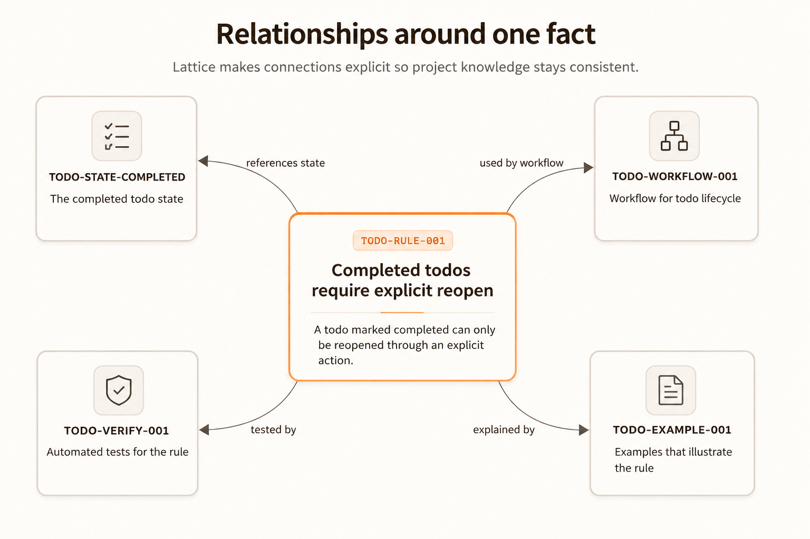

# CLI Reference

The Lattice CLI is intentionally small. Most projects use the same handful of commands.

During local development, run commands through `uv` from the checkout:

```bash
uv run lattice <command>
```

If the package is installed as a console script, `lattice <command>` works directly.

## `lattice init`

Bootstrap Lattice in a project.

```bash
uv run lattice init
```

Useful options:

```bash
uv run lattice init --lattice-dir docs/lattice
uv run lattice init --update-agents
uv run lattice init --force
```

Use `--lattice-dir` when you do not want the default `.lattice` directory.

Use `--update-agents` to add Lattice workflow guidance to `AGENTS.md`.

Use `--force` only when you intentionally want to overwrite scaffold files.

## `lattice validate`

Validate specs and references.

```bash
uv run lattice validate
```

Use this after editing specs or the type registry.

Validation is the first line of defence against broken links and malformed project memory.

Validation also checks typed tags when the type registry declares `tag_types`,
and it enforces `reference_tag_constraints` on reference fields. This lets a
project require, for example, that a workplan field only references targets
tagged `{ "type": "EntityType", "value": "BusinessEntity" }`.

Minimal registry example:

```json
{
  "tag_types": {
    "EntityType": {
      "values": ["BusinessEntity", "CodeEntity"]
    }
  },
  "workplan_requirement": {
    "extends": "knowledge_unit",
    "reference_fields": ["related_entities"],
    "reference_tag_constraints": {
      "related_entities": {
        "type": "EntityType",
        "value": "BusinessEntity"
      }
    }
  }
}
```

## `lattice render`

Render generated docs and LLM context.

```bash
uv run lattice render
```

Use this after changing specs.

Generated output should be treated as a view. Do not edit it by hand.

## `lattice render --check`

Fail if generated outputs are stale.

```bash
uv run lattice render --check
```

Use this in CI or before merging documentation/spec changes.

## `lattice audit`

Run drift and coverage audits.

```bash
uv run lattice audit
```

Use this to catch project-memory problems beyond basic schema validity.

## `lattice verify`

Run project-specific verification commands declared by Lattice specs.

```bash
uv run lattice verify
```

Use this when specs include executable checks for important facts.

Verification is how Lattice moves from structured documentation to executable project memory.

## `lattice search`

Search project memory from the registry-backed specs.

```bash
uv run lattice search "todo item"
```

Useful options:

```bash
uv run lattice search "todo item" --kind entities
uv run lattice search "lifecycle rule" --kind specs --limit 5
uv run lattice search "TodoItem" --json
```

Search ranks exact ID/name matches, aliases such as `short_name`, text matches, token overlap, and fuzzy name matches. Use `--json` when another tool or agent needs structured results.

## `lattice entities`

List entity-like knowledge units, including concepts, domain objects, enums, lifecycle types, and lifecycle values.

```bash
uv run lattice entities
uv run lattice entities --verbose
uv run lattice entities --json
```

Use this before adding a durable domain noun so you can reuse an existing owner instead of inventing a synonym.

## `lattice specs`

List specs, optionally filtered by kind or by relationship to a matching entity or spec.

```bash
uv run lattice specs
uv run lattice specs --kind decision
uv run lattice specs --uses "todo item"
uv run lattice specs --uses "todo item" --json
```

`--uses` first searches for the referenced entity or spec, then returns specs that reference it or are referenced by it.

## `lattice spec`

Search non-entity spec records such as rules, decisions, guardrails, test bindings, and schema gaps.

```bash
uv run lattice spec "generated docs"
uv run lattice spec "sidebar navigation" --json
```

Use this when you already know you are looking for a rule, decision, workflow, test binding, or other non-entity owner.

## `lattice check-new`

Check whether a proposed entity or concept probably already exists.

```bash
uv run lattice check-new "todo item"
uv run lattice check-new "supplier alias" --json
```

The command reports closest entity matches, relevant specs, and a recommendation. It is designed for maintainers and LLM agents before they create a new knowledge unit.

## `lattice graph`

Generate a Graphviz DOT relationship graph around one project fact.



```bash
uv run lattice graph SPEC-ID
```

The default `docs` profile is meant for readable generated documentation: it uses structured labels, highlights the focus node, softens the layout, and collapses noisy value sets where practical.

Useful options:

```bash
uv run lattice graph SPEC-ID --depth 2
uv run lattice graph SPEC-ID --profile docs
uv run lattice graph SPEC-ID --profile compact
uv run lattice graph SPEC-ID --profile debug
uv run lattice graph SPEC-ID --include-type domain_object
uv run lattice graph SPEC-ID --exclude-type schema_gap
uv run lattice graph SPEC-ID --output graph.dot
```

Use `--profile debug` when you want the raw relationship graph for inspection. Use `--profile docs` for documentation diagrams and `--profile compact` for smaller explanatory diagrams.

Use this when you want to see what refers to a fact and what the fact depends on.

## `--root`

Most commands accept a project root:

```bash
uv run lattice --root examples/todo validate
uv run lattice --root examples/todo render
uv run lattice --root examples/todo audit
```

Use this for examples, monorepos, or any project where the current working directory is not the Lattice root.

## Common local loop

```bash
uv run lattice validate
uv run lattice render
uv run lattice audit
```

## Common CI loop

```bash
uv run lattice validate
uv run lattice render --check
uv run lattice audit
```

Add `uv run lattice verify` when verification specs are stable enough for CI.
