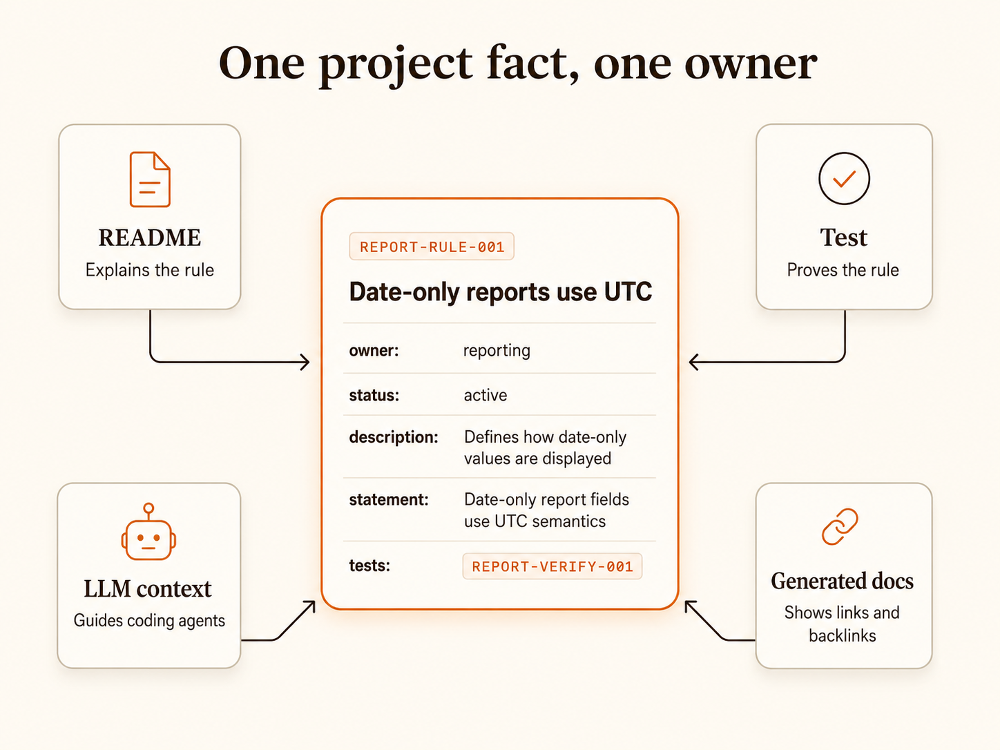
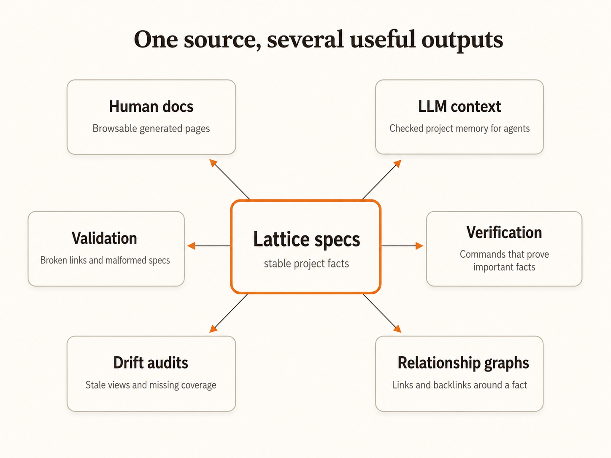

# Core Concepts

Lattice is deliberately small. It stores important project knowledge as checked, linked facts instead of scattered prose.

## Project fact

A project fact is a durable idea other work depends on.

Examples:

- a domain term
- a business rule
- an architecture decision
- a workflow
- an invariant
- a verification command
- an example that explains a rule

A project fact deserves a stable home when changing it would affect docs, tests, implementation, or LLM context.

## Canonical owner

A canonical owner is the one place a fact is defined.

Other artifacts may repeat, summarize, or apply the fact, but they should point back to the owner instead of becoming competing sources of truth.

This is the core Lattice rule: **a durable fact is authored once.**

## Registry unit

A registry unit is the minimal typed source unit in Lattice.



Every registry unit has a small common contract:

- `id`: the stable identifier other artifacts can reference
- `type` or `kind`: the registry type used by the authored spec
- `name`: the human-readable label
- `status`: usually `active`, `draft`, or `retired`
- `owner`: the optional project area responsible for the unit
- `summary`: an optional short display summary

`description` is not required by the root base. Human-facing types should
require it explicitly.

## Knowledge unit

A knowledge unit is a documented registry unit.

It is intended to explain a concept, rule, type, decision, or other durable
project meaning to humans. It adds documentation-oriented fields such as:

- `description`
- `tags`

Knowledge units are common, but they are no longer the universal root. A type
should extend `knowledge_unit` only when it genuinely needs human-facing prose
and documentation behavior.

## Spec

A spec is the authored source unit in Lattice.

It is the actual file or unit you create in a project. A spec has a stable ID,
a registry type, metadata, content fields, references, and lifecycle state.

Example:

```json
{
  "id": "LATTICE-DECISION-001",
  "type": "decision",
  "name": "Registry unit core",
  "owner": "lattice",
  "status": "active",
  "description": "Documents the spec, registry_type, registry_unit, and knowledge_unit relationship so maintainers know the minimal base contract and documented extension shape for authored Lattice units."
}
```

That is a spec. It is not a type definition. It is an instance.

## Registry type

A registry type defines the rules for a class of specs.

It describes what a spec of that type is allowed or expected to contain:
fields, validation schema, reference fields, renderer, semantic layer, and
dependency rules.

In programming terms:

- `registry_type` is like a class or type definition.
- `spec` is like an instance or object.

The analogy is useful, but do not push it too far. Lattice specs are documents
with validation metadata, not runtime objects.

## Registry unit as base

`registry_unit` is the base registry type or base spec contract.

It defines fields common to every spec:

- `id`
- `type` or `kind`
- `name`
- `status`
- `owner`
- `summary`

When you define a registry type like `enum`, it can extend `knowledge_unit` if
the enum is a human-facing documented unit. That means an enum spec is a
documented registry unit plus enum-specific fields.

Although many authored specs will be knowledge units, `knowledge_unit` is not
every spec. It is a richer documented extension over the minimal root.

References, examples, tests, and generic links are useful, but they are not
universal and are not inherited from `knowledge_unit`. Prefer typed reference
fields on specific registry types. Use generic links only for secondary
traceability or navigation, and govern their meaning with relationship kinds
when they are used.

## Stable IDs

Stable IDs let docs, tests, plans, generated context, and code comments point to the same fact.

A stable ID is useful because people and agents can say:

> This change updates the report date rule.

That is much better than repeating a paragraph and hoping every copy stays aligned.

## Links and backlinks

Lattice specs can reference other specs.

Those references become links in generated docs and backlinks on the target pages. This makes it easier to answer questions like:

- What tests prove this rule?
- What examples explain this decision?
- What workflows depend on this term?
- What generated context mentions this fact?

Hovering or focusing a generated link shows a short tooltip with the target
name, stable ID, type, and description, so readers can inspect nearby facts
without leaving the current page.

## Tags and typed tags

Tags are facets on documented units or field definitions. Plain string tags still
work for loose grouping:

```json
{
  "tags": ["planned"]
}
```

Use typed tags when the tag has validation meaning:

```json
{
  "tags": [
    { "type": "EntityType", "value": "BusinessEntity" }
  ]
}
```

Projects can declare tag types in the type registry:

```json
{
  "tag_types": {
    "EntityType": {
      "values": ["BusinessEntity", "CodeEntity"]
    }
  }
}
```

A type definition can then constrain reference fields so the referenced target
must own the classification:

```json
{
  "workplan_requirement": {
    "extends": "knowledge_unit",
    "reference_fields": ["related_entities"],
    "reference_tag_constraints": {
      "related_entities": {
        "type": "EntityType",
        "value": "BusinessEntity"
      }
    }
  }
}
```

That keeps the source of truth on the referenced spec. The workplan says it
requires business-entity targets; each target spec proves whether it is one.

## Generated docs

Generated docs are human-readable views built from the specs.



They are not the source of truth. The specs are.

When generated docs are stale, update the specs and render again.

## LLM context

Lattice can generate context for coding agents and other LLM workflows.

The point is to give agents checked, stable project memory with IDs they can reference when they make changes.

## Verification

A verification spec connects a fact to a command that can check it.

Examples:

- a pytest command proving a business rule
- a schema validation command
- a frontend contract test
- a documentation audit

This is how project memory becomes executable rather than passive.

## Drift

Drift happens when artifacts that should agree no longer agree.

Examples:

- a generated doc is stale
- a test references a retired rule
- a prompt says one thing and the source spec says another
- a domain term has two competing definitions
- an important fact has no check even though project policy requires one

Lattice does not remove the need for judgement. It gives the project a place to decide ownership, link related facts, and run checks.

## Type registry

The type registry defines the kinds of facts a project can store.

In Lattice terminology, a governed definition of a top-level spec kind is a
`registry_type`. Generated docs can label those units as "Lattice Types", but
the source of truth is the registry entry itself rather than the rendered view.

The clean hierarchy is:

- `registry_type` defines the kind.
- `registry_unit` defines the minimal base contract.
- `knowledge_unit` is the documented human-facing extension.
- `spec` is an authored instance.

Start with the built-in kinds. Add project-specific kinds only when a repeated shape becomes stable.

Do not invent a new kind just because one fact feels slightly different. That turns the registry into noise.

## Schema gaps

A schema gap records a limitation in the current modelling language.

Use a schema gap when a real fact does not fit the current registry cleanly.

That is better than hiding structure inside prose or changing core renderer code for one project-specific need.
